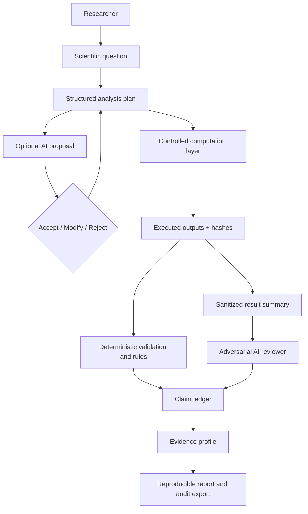
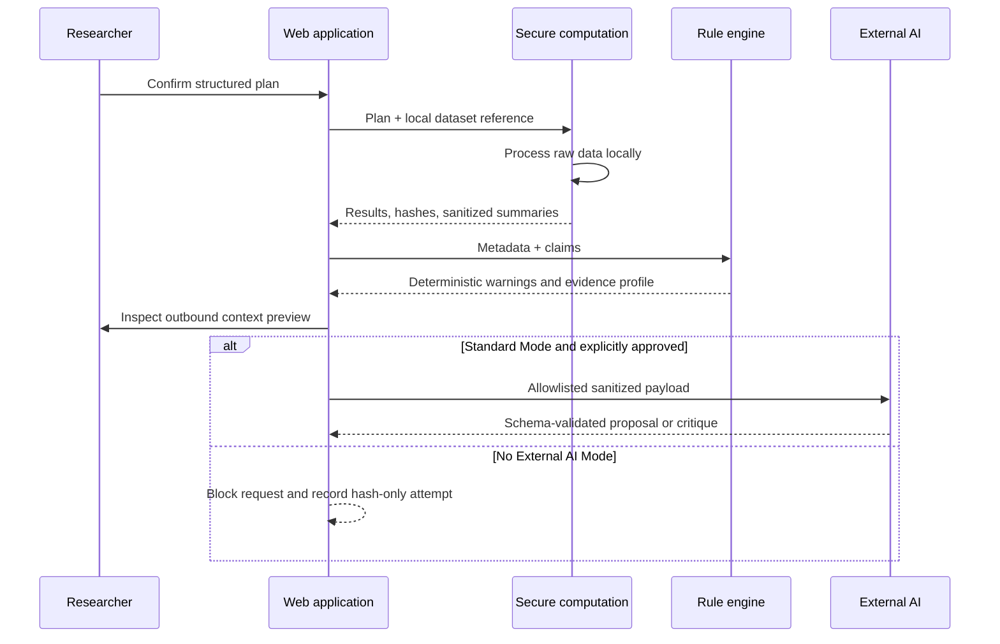

# Architecture

## System shape

## Components

- **Frontend:** Next.js-compatible TypeScript UI. The hosted MVP uses immutable synthetic seed records.
- **Application API:** FastAPI with Pydantic boundary validation and append-only provenance semantics.
- **Database:** SQLite for local development; PostgreSQL is the intended production system of record.
- **Computation:** future isolated R/Python jobs launched only from allowlisted workflow specifications.
- **Rules:** deterministic privacy, evidence, interpretation, and leakage checks.
- **AI adapter:** future provider-neutral interface. It can receive only the output of the Context Inspector.

## Data flow

## Authority model

Generated prose is never the source of truth. The authority order is: executed output → structured analysis record → deterministic validation → approved researcher decision → AI explanation.

## Major unresolved decisions

- Approved secure compute backends and job isolation profile
- Institutional identity and authorization model
- Controlled vocabulary for sensitive metadata
- Method Card curation and review governance
- Retention policy for stdout, stderr, and sanitized summaries
