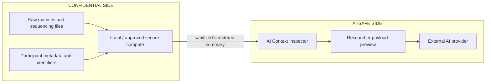

# Privacy and security

## Boundary

## Default modes

- `NO_EXTERNAL_AI_MODE`: all external AI communication is blocked.
- `STANDARD_MODE`: only allowlisted structured context may be previewed and explicitly approved.

Permitted categories include scientific questions, generic variable roles, analysis specifications, method names, software information, sanitized statistical summaries, deterministic warnings, validation summaries, and provenance summaries.

Prohibited categories include raw matrices, participant rows or identifiers, raw genetic or expression data, clinical notes, variants, uploaded file contents, sensitive filenames, and hidden metadata.

## Outbound record

Every attempted request generates a record with request ID, time, provider, purpose, allowed and blocked fields, payload hash, approval state, and status. Confidential payload bodies should not be retained merely for auditing.

## Execution security

- The web application never exposes unrestricted shell execution.
- File uploads are treated as untrusted and should be scanned and schema-validated.
- Compute jobs should use isolated containers, read-only inputs, explicit resource limits, and an allowlisted command template.
- Secrets remain outside source control and are scoped to the minimum required provider.
- Logs must redact filenames, identifiers, raw rows, and sensitive environment values.
